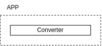

# API TEST

#### APP
```bash
uv sync --no-dev
uv run python src/converter.py
```

#### CLI
```bash
uv sync --no-dev
uv run python src/cli.py -i samples/BAK.wav -o samples/BAK.mp3
```

#### TEST & RUFF
```bash
uv sync --all-groups
uv run pytest tests

uv run ruff check src tests
uv run ruff format src tests
```

#### Deploy
```
uv pip compile pyproject.toml > requirements.txt
docker buildx build --no-cache -t afc:0.5.0 .
```

<p align="center"></p>
