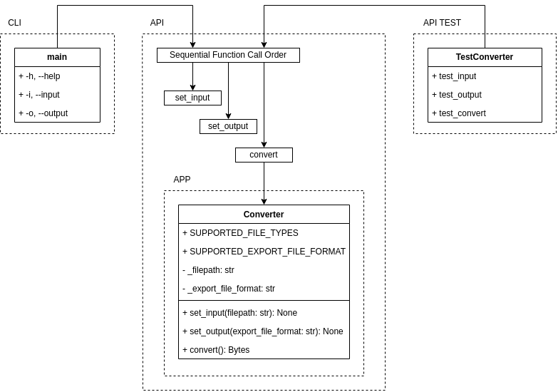

# API TEST

#### APP
```bash
uv sync --no-dev
uv run python main.py
```

#### CLI
```bash
uv sync --no-dev
uv run python cli.py -i samples/BAK.wav -o samples/BAK.mp3
```

#### TEST
```bash
uv sync
uv run pytest test_main.py
```

<p align="center"></p>
