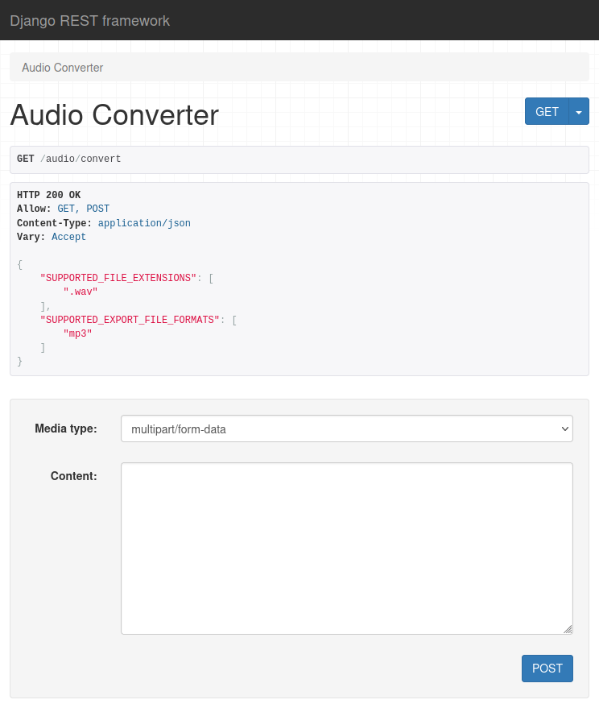

# DjangoRestFramework

#### Deploy
```
uv pip compile pyproject.toml > requirements.txt
docker buildx build --no-cache -t bdrf:0.1.0 .
```

#### Run
```bash
# LOCAL
uv run gunicorn bdrf.wsgi --bind 0.0.0.0:8000

# DOCKER
docker run -p 8000:8000 bdrf:0.1.0
```

#### API CALL
```bash
curl \
    -X POST \
    -F file=@BAK.wav \
    -H "Content-Type: multipart/form-data" \
    http://127.0.0.1:8000/?export_file_format=mp3 \
    > BAK.mp3
```

<p align="center"></p>
