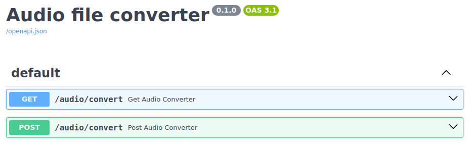

# FastAPI

#### Deploy
```
uv pip compile pyproject.toml > requirements.txt
docker buildx build --no-cache -t afc__backend_fastapi:0.1.0 .
```

#### Run
```bash
# LOCAL
export UVICORN_HOST=0.0.0.0 UVICORN_PORT=8000
uv run python main.py

# DOCKER
docker run -p 8000:8000 bfastapi:0.1.0
```

<p align="center"></p>
